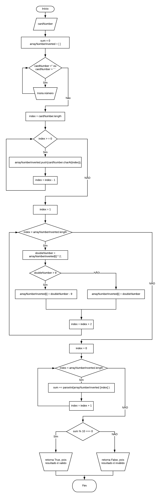

# Cartão de Crédito

## Objetivo:

Implementação do algoritmo de Luhn para validação de número de cartão de crédito.

## Pseudocódigo:

1. Usuário insere um número de cartão no prompt.
2. Verifica se é realmente um número. Entrada não pode ser vazia.
3. Os número do cartão são passados para um array de trás para frente.
4. Multiplica por 2 os valores nas posições pares (começa no index = 1) do array invertido.
5. Se esse valor dobrado for **maior** que 9, será guardado na posição corresponde do array a diferença
entre o valor dobrado e 9. Se for **menor** que 9, será guardado esse mesmo valor na posição correspondente.
6. Todos os valores do array são somados.
7. Se o resultado dessa soma/10 tiver resto 0, o cartão é válido. Se não o cartão é inválido.

## Fluxograma:

